## *Project-Bhumika*
---
### **Task 1 : Academic Management System** 

The Academic management system aims to have Student information, Course information and Enrollment information.

1. Database Creation:
Creating following tables - Student information, Course information and Enrollment information.
**Code Link:** [Database Creation](https://github.com/Bhoomi05/Project-Bhumika/blob/main/Task1_Academic_Management_System/database_creation.sql)

2. Data Creation:
Inserting the sample records of data in the tables
**Code Link:** [Data Creation](https://github.com/Bhoomi05/Project-Bhumika/blob/main/Task1_Academic_Management_System/Data_Creation.sql)

3. Retrive Student Information:
**Code Link:** [Retrive Student Information](https://github.com/Bhoomi05/Project-Bhumika/blob/main/Task1_Academic_Management_System/retieve_student_info.sql)

a. Query to retrieve student details

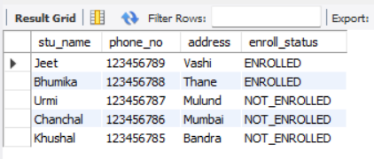

b. Query to retrieve a list of courses by "enrolled" filter

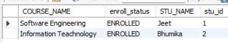

c. Query to retrieve course details

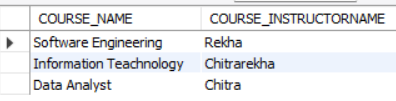

d. Query to retrieve course details for a specific course

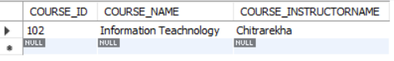

e. Query to retrieve course details for multiple course

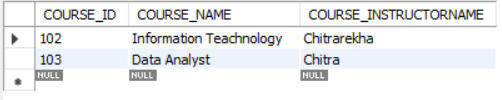

4. Reporting and Analytics using Join Queries:

**Code Link:** [Join Queries](https://github.com/Bhoomi05/Project-Bhumika/blob/main/Task1_Academic_Management_System/Reporting_and_Analytics_Using_Join_Queries)

a. Query to retrieve number of students enrolled in each course

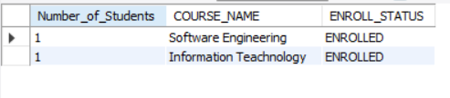

b. Query to retrieve students enrolled in specific course

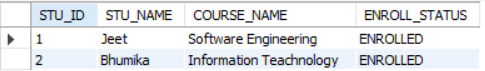

c. Query to retrieve count of enrolled students for each instructor

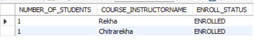

d. Query to retrieve count of enrolled students in multiple courses

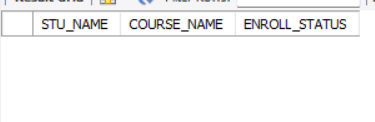

e. Query to retrieve list of courses having highest number of enrolled students arranged from highest to lowest

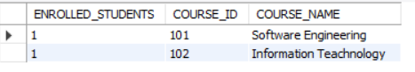

---
### **Task 2 : Student Database Management System** 

The Student Database management system aims to have Student information including their department, contact address, DOB and scores.

1. Database Setup:
Creating database Student_Database and table student_table, 
**Code Link:** [student_table](https://github.com/Bhoomi05/Project-Bhumika/blob/main/Task2_Student_Database_Management_System/Database_Setup%26Data_Entry.sql)

2. Data Entry:
Inserting 10 sample records of data in the student_table
**Code Link:** [student_table](https://github.com/Bhoomi05/Project-Bhumika/blob/main/Task2_Student_Database_Management_System/Database_Setup%26Data_Entry.sql)

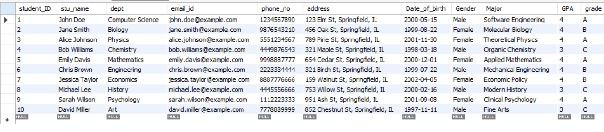