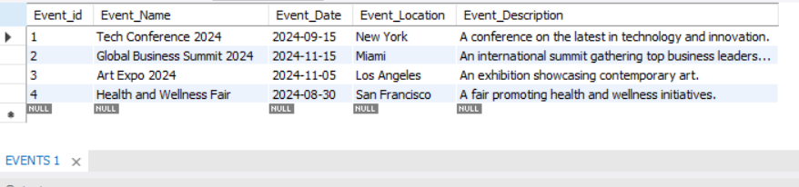
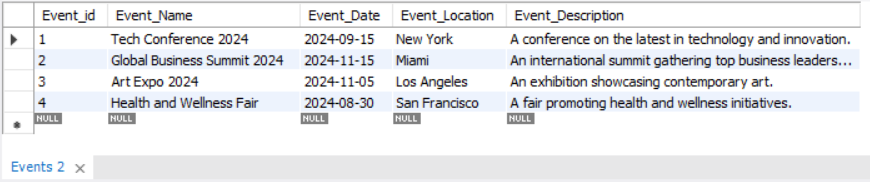
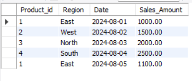
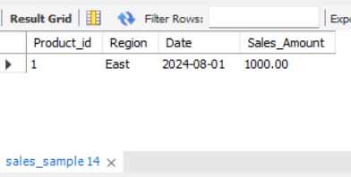

## *Project-Bhumika*
---
### **Task 1 : Academic Management System** 

The Academic management system aims to have Student information, Course information and Enrollment information.

1. Database Creation:
Creating following tables - Student information, Course information and Enrollment information.
**Code Link:** [Database Creation](https://github.com/Bhoomi05/Project-Bhumika/blob/main/Task1_Academic_Management_System/database_creation.sql)

2. Data Creation:
Inserting the sample records of data in the tables
**Code Link:** [Data Creation](https://github.com/Bhoomi05/Project-Bhumika/blob/main/Task1_Academic_Management_System/Data_Creation.sql)

3. Retrive Student Information:
**Code Link:** [Retrive Student Information](https://github.com/Bhoomi05/Project-Bhumika/blob/main/Task1_Academic_Management_System/retieve_student_info.sql)

a. Query to retrieve student details

b. Query to retrieve a list of courses by "enrolled" filter

c. Query to retrieve course details

d. Query to retrieve course details for a specific course

e. Query to retrieve course details for multiple course

4. Reporting and Analytics using Join Queries:

**Code Link:** [Join Queries](https://github.com/Bhoomi05/Project-Bhumika/blob/main/Task1_Academic_Management_System/Reporting_and_Analytics_Using_Join_Queries)

a. Query to retrieve number of students enrolled in each course

b. Query to retrieve students enrolled in specific course

c. Query to retrieve count of enrolled students for each instructor

d. Query to retrieve count of enrolled students in multiple courses

e. Query to retrieve list of courses having highest number of enrolled students arranged from highest to lowest

---
### **Task 2 : Student Database Management System** 

The Student Database management system aims to have Student information including their department, contact address, DOB and scores.

1. Database Setup:
Creating database Student_Database and table student_table, 
**Code Link:** [student_table](https://github.com/Bhoomi05/Project-Bhumika/blob/main/Task2_Student_Database_Management_System/Database_Setup%26Data_Entry.sql)

2. Data Entry:
Inserting 10 sample records of data in the student_table
**Code Link:** [student_table](https://github.com/Bhoomi05/Project-Bhumika/blob/main/Task2_Student_Database_Management_System/Database_Setup%26Data_Entry.sql)

NOTE: Subtask 1 and 2 outputs are merged

3. Student Information Retrieval:
Query to retrieve all students information from the student_table and sorting them in descending order by their grade.

**Code Link:** [Sorting_Grade_Desc](https://github.com/Bhoomi05/Project-Bhumika/blob/main/Task2_Student_Database_Management_System/Sorting_Students_Grade_Desc.sql)

4. Query for Male Students:
Query to retrieve information about all male students from the
student_table

**Code Link:** [Male Students](https://github.com/Bhoomi05/Project-Bhumika/blob/main/Task2_Student_Database_Management_System/Query_for_Male_Students.sql)

5. Query for Students with GPA less than 5.0:
Query to fetch the details of students who have a GPA less than 5.0 from the student table

**Code Link:** [GPA_less_than_5](https://github.com/Bhoomi05/Project-Bhumika/blob/main/Task2_Student_Database_Management_System/Students_with_GPA_less_than_5.sql)

](GPA_Less_than_5.png)

6. Update Student Email and Grade:
Update Query statement to modify the email and grade of a student with a specific ID in the student table

**Code Link:** [Update Student Email and Grade](https://github.com/Bhoomi05/Project-Bhumika/blob/main/Task2_Student_Database_Management_System/Update_Student_Email_and_Grade.sql)

7. Query for Students with Grade B:
Query to retrieve the names and ages of all students who have a grade of B from the student table

**Code Link:** [Students with Grade B](https://github.com/Bhoomi05/Project-Bhumika/blob/main/Task2_Student_Database_Management_System/Students_with_Grade_B.sql)

8. Query for Grouping and Calculation:
Query to group the student_table by the Department and Gender columns and calculate the average GPA for each combination

**Code Link:** [Grouping and Calculation](https://github.com/Bhoomi05/Project-Bhumika/blob/main/Task2_Student_Database_Management_System/Grouping_and_Calculation.sql)

9. Query for Table Renaming:
Query to rename the student_table to student_info using the appropriate SQL statement

**Code Link:** [Table Renaming](https://github.com/Bhoomi05/Project-Bhumika/blob/main/Task2_Student_Database_Management_System/Table_Renaming.sql)

10. Query for Retrieving Student with Highest GPA:
Query to retrieve the name of the student with the highest GPA from the student info table.

**Code Link:** [Retrieve Student with Highest GPA](https://github.com/Bhoomi05/Project-Bhumika/blob/main/Task2_Student_Database_Management_System/Student_with_Highest_GPA.sql)

---
### **Task 3 : Event Management System** 

This task develops the application that allows users to create and manage events, track attendees, and handle event registrations efficiently.

1. Database Creation:
Creating database EventsManagement and tables for tables for Events, Attendees, and Registrations 

**Code Link:** [Database Creation](https://github.com/Bhoomi05/Project-Bhumika/blob/main/Task3_Event_Management_System/Database_Creation.sql)

2. Data Creation:
Inserting 10 sample records of data for Events, Attendees, and Registrations tables with respective fields.

**Code Link:** [Data Creation](https://github.com/Bhoomi05/Project-Bhumika/blob/main/Task3_Event_Management_System/Data_Creation.sql)

NOTE: Subtask 1 and 2 outputs are merged

3. Manage Event Details:
Query to perform Insert Update and Delete operations on Event Table.

a) Inserting a New Event

**Code Link:** [Insert Event](https://github.com/Bhoomi05/Project-Bhumika/blob/main/Task3_Event_Management_System/Inserting_Event.sql)

b) Updating an Event's Information

**Code Link:** [Update Event](https://github.com/Bhoomi05/Project-Bhumika/blob/main/Task3_Event_Management_System/Updating_Event_Information.sql)

c) Deleting an event

**Code Link:** [Delete Event](https://github.com/Bhoomi05/Project-Bhumika/blob/main/Task3_Event_Management_System/Deleting_Event.sql)

4. Manage Track Attendees Handle Events:
Query to insert and register new attendee.

a) Inserting a new attendee

**Code Link:** [Insert New Attendee](https://github.com/Bhoomi05/Project-Bhumika/blob/main/Task3_Event_Management_System/Insert_Attendee.sql)

b) Registering an attendee for an event.

**Code Link:** [Register attendee](https://github.com/Bhoomi05/Project-Bhumika/blob/main/Task3_Event_Management_System/Registering_Attendee_for_Event.sql)

5. Develop queries to retrieve event information, generate attendee lists, and calculate event attendance statistics.

**Code Link:** [Events and Attendee Statistics](https://github.com/Bhoomi05/Project-Bhumika/blob/main/Task3_Event_Management_System/Event_and_Attendees_Statistics.sql)

Event information

Attendee List

Event Attendance Statistics-

Total revenue generated by each event

Total number of attendees for each event

---

### **Task 4 : OLAP Operations** 

Objective: Perform OLAP operations (Drill Down, Rollup, Cube, Slice, and Dice) on the sales_sample table to analyze sales data.

1. Database Creation:
Creating a database to store the sales data and a table named sales_sample with the columns: Product_ld, Region,
Date, Sales_Amount

**Code Link:** [Database Creation](https://github.com/Bhoomi05/Project-Bhumika/blob/main/Task4_OLAP_Operations/Database_Creation.sql)

2. Data Creation:
Inserting 10 sample records into the sales_sample table, representing sales data.

**Code Link:** [Data Creation](https://github.com/Bhoomi05/Project-Bhumika/blob/main/Task4_OLAP_Operations/Data_Creation.sql)

NOTE: Subtask 1 and 2 outputs are merged

3. Performing OLAP operations:

a) Drill Down- Query to perform drill down from region to product level to understand sales performance

**Code Link:** [Drill Down](https://github.com/Bhoomi05/Project-Bhumika/blob/main/Task4_OLAP_Operations/Drill_Down.sql)

b) Rollup- A query to perform roll up from product to region level to view total sales by region.

**Code Link:** [Rollup](https://github.com/Bhoomi05/Project-Bhumika/blob/main/Task4_OLAP_Operations/Roll_Up.sql)

c) Cube - A query to explore sales data from different perspectives, such as product, region, and date. As MYSQL does not support CUBE keyword, we have used UNION ALL.

**Code Link:** [Cube](https://github.com/Bhoomi05/Project-Bhumika/blob/main/Task4_OLAP_Operations/Cube_Using_Union_All.sql)

d)Slice- A query to slice the data to view sales for a particular region or date range.

**Code Link:** [Slice](https://github.com/Bhoomi05/Project-Bhumika/blob/main/Task4_OLAP_Operations/Slice.sql)

e) Dice - A query to view sales for specific
combinations of product, region, and date

**Code Link:** [Dice](https://github.com/Bhoomi05/Project-Bhumika/blob/main/Task4_OLAP_Operations/Dice.sql)

